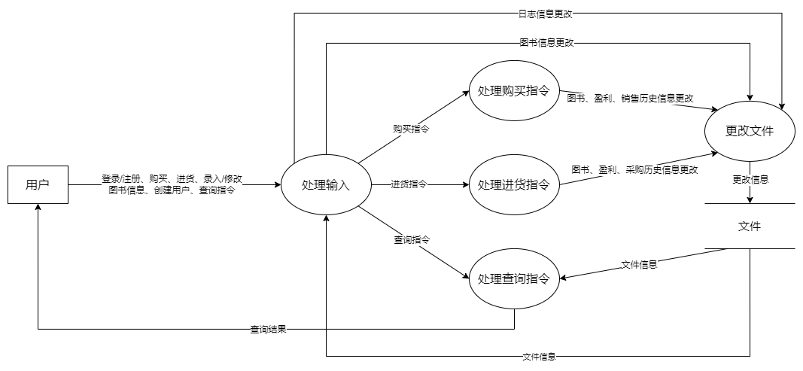
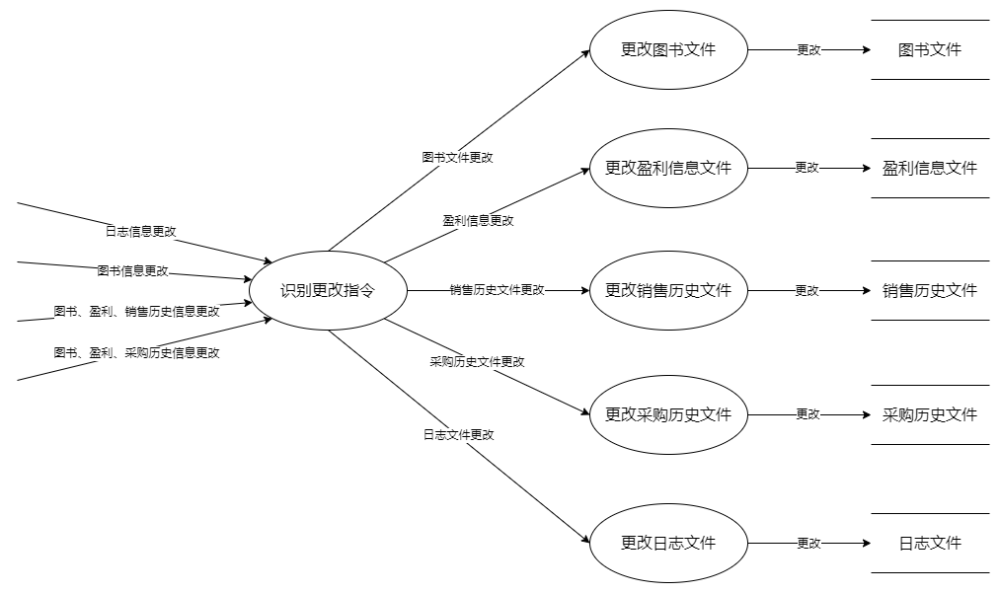

# 功能设计

## 输入处理模块

功能：对指令进行分类并检查用户的输入是否合法、更新当前账户的状态、向其他模块分派指令、向文件更改模块发送日志更新信息、图书更改信息

## 购买指令处理模块

功能：根据购买指令，输出对图书文件、盈利信息文件、销售历史文件要做的修改。

## 进货指令处理模块

功能：根据进货指令，输出对图书文件、盈利信息文件、采购历史文件要做的修改。

## 查询指令处理模块

功能：识别查询指令的类别，进行分别的查询操作，并输出给用户。

## 文件更改模块

功能：识别更改指令的类别，进行分别的更改操作。

# 用户交互设计

- 格式：**粗体字**为提示词，\<\>内是参数，全大写词语为命令。

- 提示信息：

  若指令格式错误，打印：INVALID OPERATION!

  若\<variable\>不符合条件，默认提示信息：INVALID \<VARIABLE\>!

  若有其他错误，打印下文中所写的信息。

  若无错误，打印：\<operation_name\> SUCCESSFULLY！

- 先打印提示信息。若成功执行，再打印输出。

## 登录/注册指令

### 登录

输入：

LOGIN \<user_name\>

提示信息：

若重复登录，打印：REPEATED LOGIN!

### 注册

输入：

RESIGTER \<user_name\> \<type\>

提示信息：

若type不合条件，打印：INVALID TYPE!

若账号已存在，打印：ACCOUNT EXISTS!

### 登出

输入：

LOGOUT

## 创建账户指令

输入：

CREATACCOUNT \<user_name\> \<type\>

提示信息：

若type不合条件，打印：INVALID TYPE!

若账号已存在，打印：ACCOUNT EXISTS!

## 购买指令

输入：

BUYBOOK \<ISBN\> \<num\>

提示信息：

若书不存在，打印：CANNOT FIND BOOK!

若存货不足，打印：BOOK NOT ENOUGH!

## 进货指令

输入：

ADDBOOK

**ISBN: **\<ISBN\>

**number: **\<purchasing_num\>

**purchasing price: **\<purchasing_price\>

提示信息：

若ISBN不符合条件，打印：INVALID ISBN!

若num不符合条件，打印：INVALID NUMBER!

若purchasing_price不符合条件，打印：INVALID PURCHASING PRICE!

## 录入/修改图书信息指令

输入：

ENTERINFORMATION（或MODIFYINFORMATION） \<ISBN\>

**ISBN: **\<ISBN\>

**book name: **<book_name>

**author: **\<author\>

**key words: **\<word1\> \<word2\>, ……

**stock: **\<stock\>

**price: **\<price\>

## 查询指令

### 查询图书

输入：

QUERYBOOK

**ISBN: **\<ISBN\>

**author: **\<author\>

**key words: **\<word1\>, \<word2\>, ……

**book name: **\<book_name\>

输出：

每一行代表一种图书：\<ISBN\> \<book_name\> \<author\> \<stock\> \<price\>

### 查询盈利信息

输入：

QUERYPROFIT \<begin_time\> \<end_time\>

输出：

\<income\> \<spending\> \<profit\>

### 查询销售历史

输入：

QUERYSALES \<begin_time\> \<end_time\>

输出：

每一行代表一次销售：\<ISBN\> \<num\> \<price\>

### 查询采购历史

输入：

QUERYPURCHASE \<begin_time\> \<end_time\>

输出：

每一行代表一次采购：\<ISBN\> \<purchase_num\> \<purchase_price\>

### 查询系统工作日志

输入：

QUERYLOG

输出：

每一行代表一次操作：\<type\> \<user_name\> \<operation\>

### 查询员工工作情况

输入：

QUERYWORKER

输出：

每一行代表一次操作：\<user_name\> \<operation\>

# 数据库设计

## 图书文件

### book

按ISBN顺序存储书籍信息。每个记录有六个分量：ISBN、作者、书名、key_words_of_book文件中该书籍对应的链表的头结点的索引、库存、单价。

### key_words_of_book

用链表的形式存储书籍的每一个关键词。每个记录有两个分量：关键词在key_words文件中的索引、该书籍下一个关键词在key_words_of_book文件中的索引。

### key_words

用块状链表存储每一个关键词和对应的图书。每个记录有两个分量：关键词、books_of_key_word文件中该关键词对应的链表的头结点的索引。

### books_of_key_word

用链表的形式存储一个关键词对应的所有书籍。每个记录有两个分量：书籍的ISBN，该关键词下一本书籍在books_of_key_word文件中的索引。

### author

用块状链表存储每一个作者和对应的图书。每个记录有两个分量：作者、books_of_author文件中该作者对应的链表的头结点的索引。

### books_of_author

用链表的形式存储一个作者的所有书籍。每个记录有两个分量：书籍的ISBN，该作者下一本书在books_of_author文件中的索引。

### book_name

用块状链表存储每一个书名和对应的图书。每个记录有两个分量：书名、books_of_book_name文件中该书名对应的链表的头结点的索引。

### books_of_book_name

用链表的形式存储一个书名的所有书籍。每个记录有两个分量：书籍的ISBN，该书名下一本书在books_of_book_name文件中的索引。

## 盈利信息文件

### profit

用块状链表按时间顺序存储累计收入、支出信息。每个记录是在出现收入和支出时书店的累计收入和累计支出，有三个分量：时间、累计收入、累计支出。

## 销售历史文件

### sales

用块状链表按时间顺序存储销售历史。每个记录是一次销售，有四个分量：时间、ISBN、数量、单价。

## 采购历史文件

### buy

用块状链表按时间顺序存储采购历史。每个记录是一次采购，有四个分量：时间、ISBN、数量、进货单价。

## 日志文件

### log

按时间顺序存储系统工作过程。每个记录是用户的一次操作，有三个分量：用户名、用户类型、指令。

## 账户文件

### account

存储目前登录的账号。每个记录是一个账号，有两个分量：用户名和用户类型。越考后的账号登录的时间越晚。

# 类、结构体设计

## Instruction

virtual bool CheckParameter() = 0;

virtual bool CheckAccess() = 0;

virtual std::vector<Modification *> Execute() = 0;

virtual InstructionType GetInstructionType() = 0;

### LogInOutInstruction

### BuyInstruction

### SalesInstruction

### QueryInstruction

QueryType GetQueryType();

#### QueryBookInstruction

#### QueryProfitInstruction

#### QuerySalesInstruction

#### QueryBuyInstruction

#### QueryLogInstruction

#### QueryWorkerInstruction

## Modification

ModificationMessage message;

virtual void Modify() = 0;

virtual ModificationType GetModificationType();

### BookModification

### ProfitModification

### SalesModification

### BuyModification

### LogModification

## ModificationMessage

### BookModificationMessage

### ProfitModificationMessage

### SalesModificationMessage

### BuyModificationMessage

### LogModificationMessage